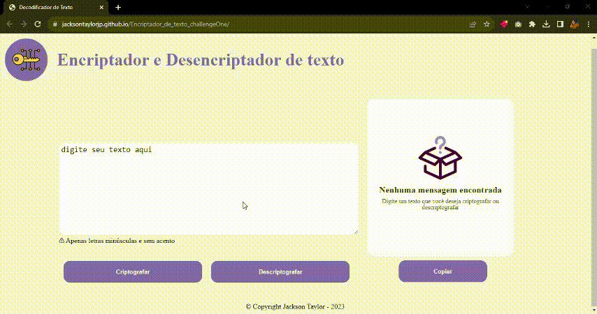

# Encriptador_de_texto_challengeOne

Codificador e decodificador de texto utilizando HTML, CSS e Javascript. Desafio do Programa Oracle ONE.

Este projeto tem o objetivo de codificar um texto, assim como decodifica-lo baseado em critérios.

Critérios utilizados:

 

A letra "e" é convertida para "enter"

A letra "i" é convertida para "imes"

A letra "a" é convertida para "ai"

A letra "o" é convertida para "ober"

A letra "u" é convertida para "ufat"

 

 
    

